# springbootA362
springbootA362基于Java Springboot民宿管理系统
 
## 查看主页获取源码

### 一、作品包含

源码+数据库+设计文档万字+全套环境和工具资源+部署教程

### 二、项目技术

前端技术：Html、Css、Js、Vue3、Element-ui 
数据库：MySQL
后端技术：Java、SpringBoot2.0、MyBatis

  

### 三、运行环境

开发工具：IDEA/eclipse  + vscode

数据库：MySQL8.0+

数据库管理工具：Navicat10以上版本

环境配置软件： JDK1.8 + Maven3.6.3

前端Nodejs：16

浏览器：谷歌浏览器

### 四、项目介绍
项目编号：springbootA362

该系统旨在提供一个高效、便捷的平台，用于民宿信息的发布、预订管理、客户关系维护以及数据分析等功能。基于SpringBoot的民宿平台管理系统
角色：普通游客（用户）、管理员两种角色
技术：springboot+vue（前后端分离）+ MySQL
系统首页：浏览民宿酒店类型，可以通过时间搜索、民宿名称、民宿类型进行搜索
点击查看房间简介：查看民宿简介、评论
预定民宿：在民宿详情页面进行预订
用户登录or注册：用户进行登录才能进行预订
后台管理系统：
可视化统计模块：
	预订访问统计可视化界面
用户管理模块：
	用户管理：用户进行管理
	管理员工管理：民宿管理员进行管理
	员工管理：民宿员工管理
系统菜单管理模块：
	菜单管理：系统菜单管理
	角色管理：民宿用户角色进行管理
	日志管理：系统日志查看
	文件管理：系统文件管理
民宿管理模块：
	房源管理：民宿房源进行管理
	房源图片管理：房源图片进行管理
订单管理模块：
	订单管理：民宿订单管理
	财务管理：民宿财务统计管理
业务办理模块：
	民宿预订/入住管理：接受用户入住进行确认
管理
	预订处理：对预订房源进行管理
	入住管理/退房管理：用户退房管理
### 五、运行截图

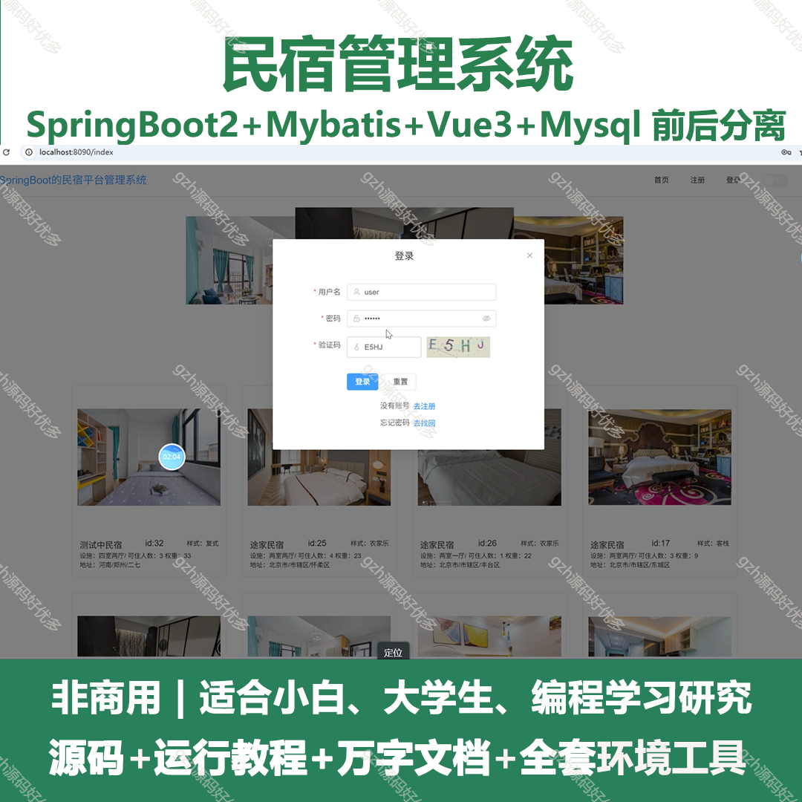
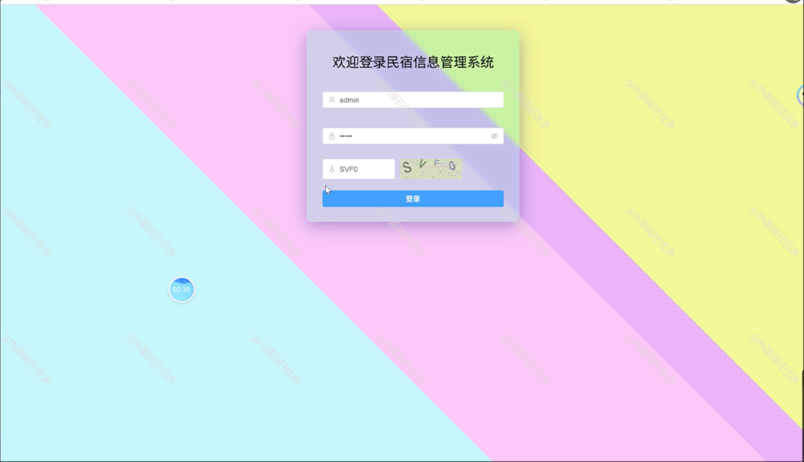
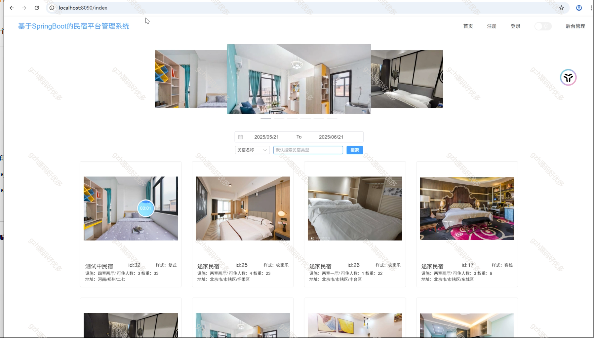
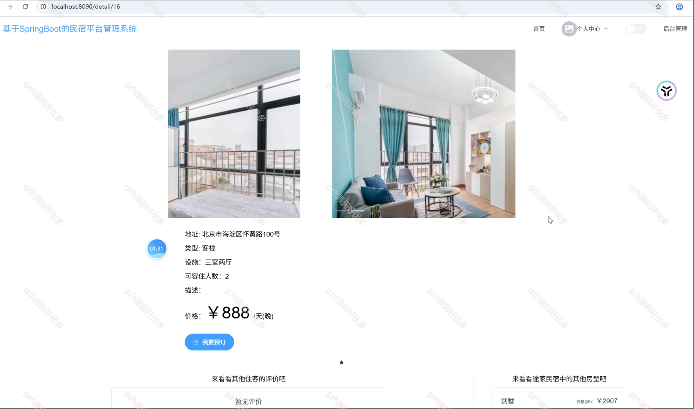
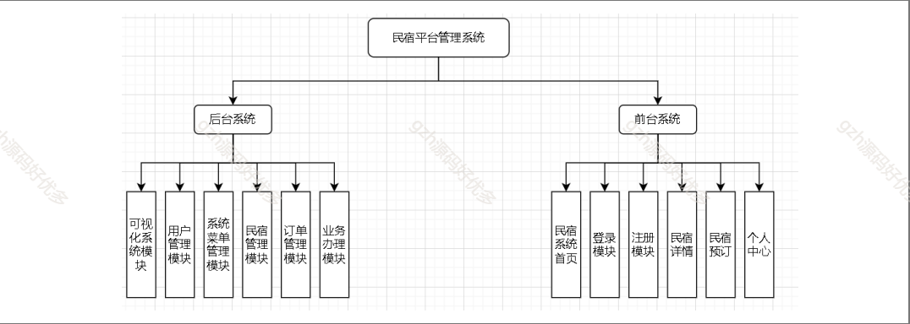
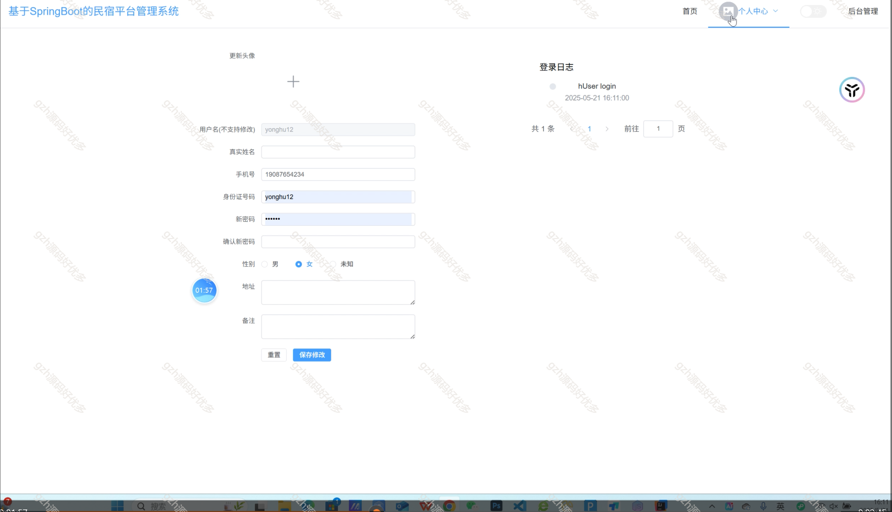
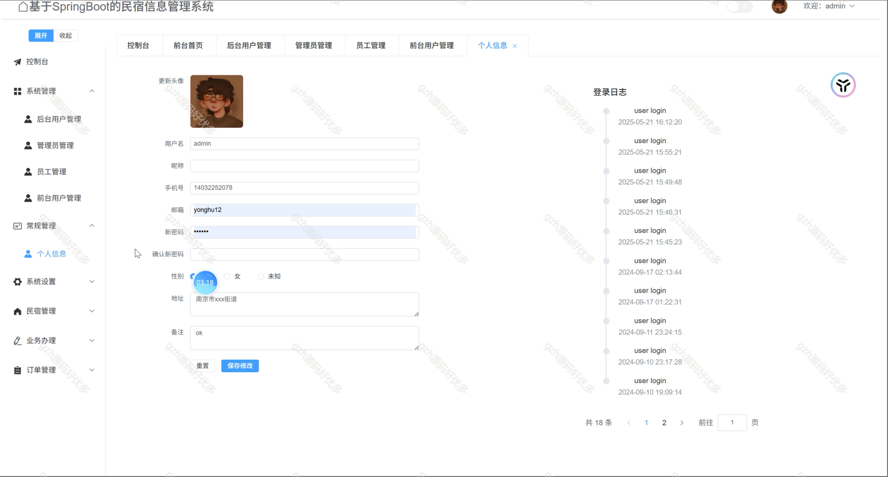
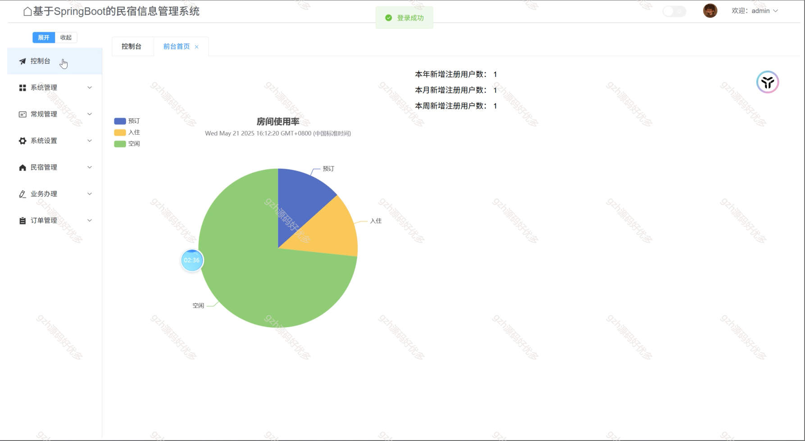
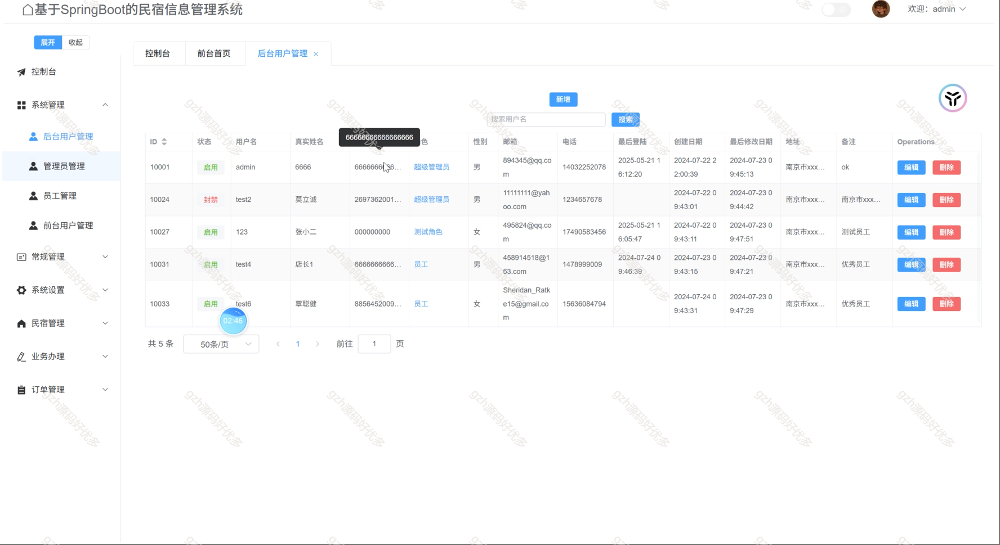
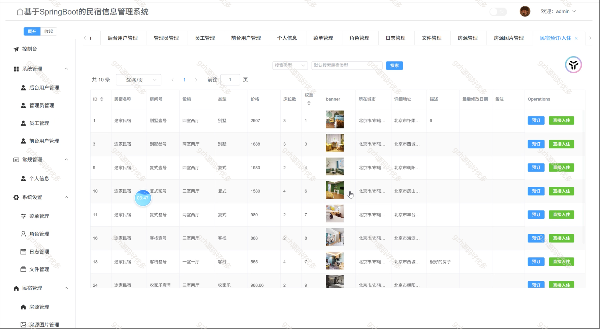
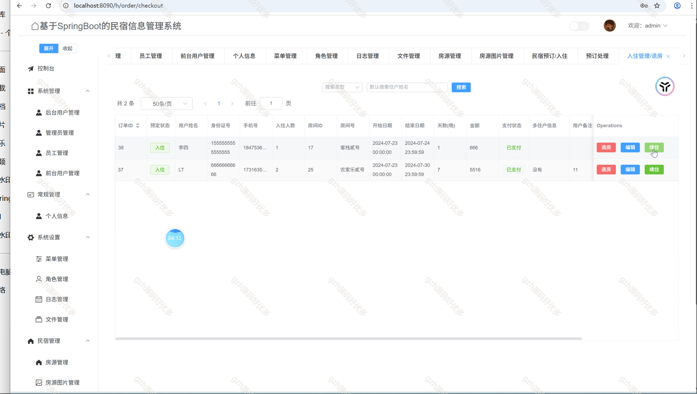

  
